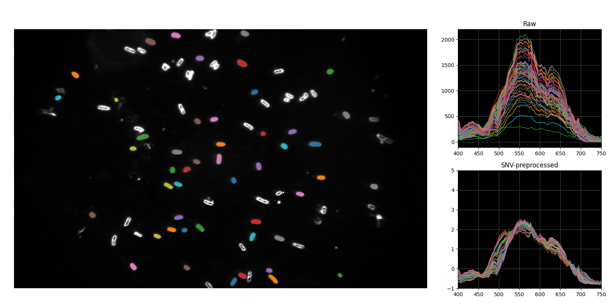

# salmonella-serovar-classification-foods
This repository is for the article **"Rapid *Salmonella* Serovar Classification Using AI-Enabled Hyperspectral Microscopy with Enhanced Data Preprocessing and Multimodal Fusion"**, published in Foods.

- Preprint: [doi: 10.20944/preprints202507.1691.v1](https://doi.org/10.20944/preprints202507.1691.v1)
- Final Paper: [doi: 10.3390/foods14152737](https://doi.org/10.3390/foods14152737)


## Requirements

The required Python packages and versions for data processing, modeling, and visualization are listed in `requirements.txt`. Install with:
```
pip install -r requirements.txt
```


## Dataset

The processed dataset (i.e., single-cell spectra and RGB composite images) is available on Zenodo at [doi: 10.5281/zenodo.16740800](https://zenodo.org/records/16740800).

- `spectra_single_cell.csv`: Single-cell spectral data extracted from hyperspectral data cubes ("hypercubes"). Each row contains the spectral features and serovar label of one bacterial cell. Note that each hypercube contains multiple cells.
- `images.zip`: RGB composite images generated from each hypercube, with one image corresponding to one hypercube. This image directory follows the PyTorch `ImageFolder`-style structure: 

```bash
images/
├── train/
│   ├── Enteritidis/
│   ├── Infantis/
│   └── ...
└── evaluate/
    ├── img001.png
    ├── img002.png
    └── ...
```


## Extracting Single-Cell Spectra from Raw Hypercube Data

- `bacterial_hmi`: A Python package for auto segmentation of single bacterial cells from hypercube data. Developed by USDA-ARS, this tool is restricted to internal use and not included in this repository. For methodological details, see [this work](https://doi.org/10.1016/j.compag.2023.107802).

    Example visualized output: 
  
- `test_hmi.py`: This script is for running bacterial segmentation on hypercube data.


## Spectral Branch

- `Serovar_PCA_ML_111524.ipynb`: This interactive notebook includes two components:
    - **Feature engineering:** Manual feature selection and data-driven feature extraction from single-cell spectral data.
    - **Classification:** Traditional machine learning models trained on both manually selected and data-driven spectral features for serovar classification.


## Image Branch and Multimodal Fusion
  
- `fusion_2_cpu.ipynb`: This interactive notebook contains model training and evaluation for multimodal fusion of spectral and image-based features. It uses an MLP for spectral features (from data-driven extraction) and EfficientNetV2 for image-based features.


## Funding

- MSU Startup Funds
- USDA ARS Research Support Agreements (No. 58-6040-3-017 and 58-6040-4-041). Any opinion, findings, conclusion, or recommendations expressed in this paper are those of the author(s) and do not necessarily reflect the view of USDA.
